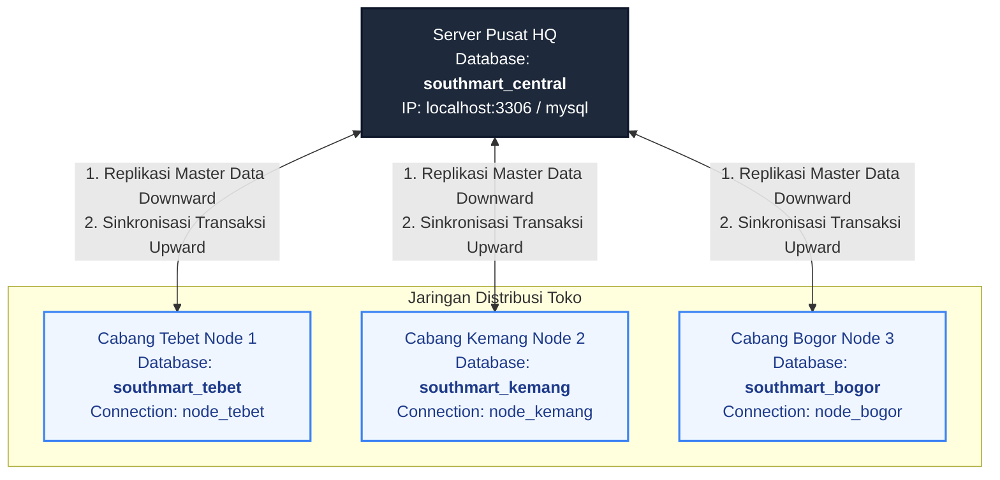

# DOKUMENTASI PROYEK (WAJIB)
## SOUTHMART POS — SISTEM DATABASE TERDISTRIBUSI RITEL

Dokumentasi ini disusun untuk memenuhi kebutuhan Laporan Proyek Akhir mata kuliah Database Terdistribusi. Proyek ini mengimplementasikan sistem Point of Sale (POS) ritel modern bernama **SouthMart** dengan arsitektur database terdistribusi multi-node (1 Node Pusat/HQ dan 3 Node Cabang).

---

## 1. Arsitektur Sistem

Desain arsitektur database terdistribusi SouthMart POS didasarkan pada model **Hub-and-Spoke Topology** (Topologi Bintang / Server Pusat dan Cabang). 

### Karakteristik Arsitektur
1. **Server Pusat (Central HQ Node / `southmart_central`)**:
   - Berfungsi sebagai aggregator data transaksi nasional dari seluruh cabang.
   - Menyediakan panel monitoring status koneksi node cabang secara real-time.
   - Mengelola master data global (katalog produk, kategori, data pengguna, dan data cabang).
   - Menjalankan audit konsistensi data silang (cross-node consistency check).
   - Menyediakan laporan analitik omzet penjualan gabungan nasional.
2. **Branch Nodes (3 Cabang Toko)**:
   - **Tebet Node (`southmart_tebet` / Branch ID: 1)**
   - **Kemang Node (`southmart_kemang` / Branch ID: 2)**
   - **Bogor Node (`southmart_bogor` / Branch ID: 3)**
   - Setiap cabang memiliki database lokal MySQL mandiri untuk melayani operasional transaksi kasir (POS) secara cepat, andal, dan toleran terhadap kegagalan jaringan (offline tolerance).

### Diagram Arsitektur Node



---

## 2. Desain Fragmentasi & Replikasi

Untuk menyeimbangkan antara ketersediaan data lokal (lokalitas) dan konsistensi data global, database SouthMart dirancang menggunakan kombinasi teknik **Replikasi Penuh (Full Replication)** dan **Fragmentasi Horizontal (Horizontal Fragmentation / Sharding)**.

### A. Skema Replikasi Data (Master Data)
Data master yang bersifat global disalin secara penuh ke seluruh node cabang. Hal ini menjamin kasir tetap dapat mengautentikasi login dan melakukan pencarian produk beserta harga terbaru meskipun koneksi internet ke pusat terputus (offline).

| Nama Tabel | Tipe Replikasi | Deskripsi & Tujuan |
| :--- | :--- | :--- |
| `branches` | Replikasi Penuh (Full) | Berisi metadata seluruh cabang operasional SouthMart. |
| `categories` | Replikasi Penuh (Full) | Daftar kategori produk global untuk pengelompokan item. |
| `products` | Replikasi Penuh (Full) | Katalog produk lengkap beserta barcode, SKU, dan harga jual global. |
| `users` | Replikasi Penuh (Full) | Data akun login administrator dan kasir di setiap cabang. |

### B. Skema Fragmentasi Horizontal (Data Transaksi & Stok)
Tabel transaksi dan mutasi stok di-fragmentasi secara horizontal menggunakan metode **Range/List Horizontal Fragmentation** berdasarkan kolom `branch_id`.

- **Aturan Fragmentasi Horizontal**:
  - Transaksi dengan `branch_id = 1` hanya disimpan di database `southmart_tebet` saat transaksi terjadi.
  - Transaksi dengan `branch_id = 2` hanya disimpan di database `southmart_kemang` saat transaksi terjadi.
  - Transaksi dengan `branch_id = 3` hanya disimpan di database `southmart_bogor` saat transaksi terjadi.
  
- **Tabel Terfragmentasi**:
  - `transactions` (Data master transaksi ritel)
  - `transaction_details` (Item belanja per transaksi)
  - `payments` (Informasi metode dan nominal pembayaran)
  - `receipts` (Catatan cetak struk belanja)
  - `inventory` (Stok barang lokal unik per cabang)
  - `stock_movements` (Mutasi stok masuk/keluar lokal cabang)

- **Konsolidasi Pusat**:
  Server Pusat (`southmart_central`) bertindak sebagai wadah agregasi global yang menyimpan salinan seluruh fragmen dari semua cabang guna kebutuhan analitik nasional dan audit.

---

## 3. Penjelasan Alur Data dan Distribusinya

Siklus hidup data di SouthMart POS dibagi menjadi tiga alur utama:

```
[Server Pusat] -- (1. Replikasi Master Downward) --> [Database Lokal Cabang]
                                                            |
                                                   (Transaksi Kasir Ritel)
                                                            v
[Server Pusat] <-- (2. Sinkronisasi Upward / Sync) -- [Transaksi Tersimpan Lokal]
```

### A. Alur Replikasi Master Data (Downward Flow)
1. Administrator menambahkan produk baru atau mengubah harga di Server Pusat.
2. Server Pusat memicu proses replikasi (bisa otomatis via Cron Job atau manual via tombol admin).
3. Menggunakan operasi **SQL UPSERT (Update or Insert)**, Server Pusat mendorong data terbaru ke seluruh database cabang yang sedang online.
4. Jika suatu cabang offline, status replikasi ditandai `failed` untuk tabel tersebut, dan akan dicoba kembali saat koneksi pulih.

### B. Alur Transaksi Kasir & Sinkronisasi (Upward Flow)
1. Kasir melakukan pemindaian barcode atau input belanja di aplikasi POS lokal.
2. Transaksi disimpan di database cabang tempat kasir bertugas dengan default status sinkronisasi `sync_status = 'pending'`.
3. Jika jaringan internet terdeteksi online:
   - Aplikasi segera mengirimkan salinan transaksi ke Server Pusat (HQ).
   - Setelah server pusat mengonfirmasi data berhasil masuk, status di database cabang diubah menjadi `synced`.
4. Jika jaringan internet offline:
   - Transaksi tetap sukses diproses di kasir dan disimpan lokal.
   - Status tetap `pending` (Antrean sinkronisasi lokal).
   - Pengoperasian toko tidak terganggu sama sekali (Partition Tolerance).

### C. Alur Sinkronisasi Manual / Berkala (Reconciliation)
1. Saat cabang offline kembali online, kasir dapat menekan tombol **"Sinkronisasi Transaksi"** pada panel kasir, atau Administrator menekan **"Sinkronisasi Semua Node"** di dashboard monitoring pusat.
2. Sistem akan mendeteksi seluruh transaksi berstatus `pending` di node tersebut, memindahkannya ke pusat secara aman menggunakan database transaction (`DB::transaction`) untuk memastikan operasi atomik, dan mengubah status lokal menjadi `synced`.

---

## 4. Panduan Instalasi dan Testing Aplikasi

### A. Panduan Instalasi
Sistem ini dibangun menggunakan framework **Laravel 11** dan database **MySQL**. Ikuti langkah berikut untuk memasang aplikasi di lingkungan lokal:

1. **Prasyarat**:
   - Pastikan Anda menggunakan **Laragon** atau XAMPP (dilengkapi PHP 8.2 atau lebih baru, dan MySQL Server).
   - Composer sudah terinstal.
2. **Penempatan Proyek**:
   - Letakkan folder proyek di `C:\laragon\www\southmart`.
3. **Konfigurasi Environment (`.env`)**:
   - Pastikan file `.env` di direktori utama proyek memiliki kredensial MySQL yang benar:
     ```env
     DB_CONNECTION=mysql
     DB_HOST=127.0.0.1
     DB_PORT=3306
     DB_DATABASE=southmart_central
     DB_USERNAME=root
     DB_PASSWORD=
     ```
4. **Instalasi Dependensi & Inisialisasi Database Terdistribusi**:
   - Jalankan terminal / command prompt di dalam folder proyek, lalu eksekusi Composer install (jika diperlukan):
     ```bash
     composer install
     ```
   - SouthMart menyediakan perintah penginstal database otomatis. Jalankan perintah artisan berikut:
     ```bash
     php artisan southmart:setup --fresh
     ```
     *Perintah ini otomatis membuat 4 database MySQL secara nyata (`southmart_central`, `southmart_tebet`, `southmart_kemang`, dan `southmart_bogor`), menjalankan migrasi skema tabel di keempat database, dan mengisi data awal (seeding) beserta simulasi beberapa transaksi historis.*
5. **Menjalankan Aplikasi**:
   - Jalankan server lokal Laravel:
     ```bash
     php artisan serve --port=8000
     ```
   - Akses aplikasi di browser melalui URL: `http://localhost:8000`.

---

### B. Skenario Pengujian Sistem (Testing)

#### Skenario 1: Demo Replikasi Master Data (Pusat ke Cabang)
1. Masuk ke aplikasi sebagai **Admin Pusat** (gunakan login cepat admin di halaman login).
2. Pilih menu **Produk**, lalu klik **Tambah Produk Baru**. Isi data produk (contoh: Barcode `89912345`, Nama: `Roti Tawar Pandan`, Harga Jual: `15000`).
3. Buka browser baru (atau mode penyamaran/Incognito), login sebagai **Kasir Tebet**.
4. Buka menu POS. Cari nama produk `Roti Tawar Pandan`. Produk baru tersebut langsung muncul dan siap dijual. Ini membuktikan replikasi data produk berjalan secara instan dari pusat ke cabang.

#### Skenario 2: Simulasi Offline & Sinkronisasi Tertunda (Pending Sync)
1. Pada Dashboard Admin Pusat, perhatikan kartu status node **SouthMart Tebet** (berwarna Hijau/Online).
2. Klik tombol **Putuskan Koneksi (Simulasi)** pada kartu tersebut. Indikator berubah menjadi merah (Offline).
3. Login sebagai **Kasir Tebet** dan buat transaksi pembelian (misal beli 2 Indomie Goreng). Selesaikan pembayaran.
4. Sistem akan sukses mencetak struk secara lokal, namun di pojok kanan atas aplikasi POS kasir akan muncul indikator badge kuning **"1 Transaksi Pending Sync"**.
5. Kembali ke Dashboard Admin. Anda akan melihat total omzet pusat tidak bertambah, karena data transaksi Tebet masih tertahan di database lokal cabang akibat status simulasi offline.
6. Klik tombol **Hubungkan Koneksi (Online)** untuk mengembalikan status online cabang Tebet.
7. Di panel kasir Tebet, klik tombol **Sinkronisasi Transaksi** (atau klik **Sinkronisasi Semua** pada dashboard admin).
8. Indikator pending sync di kasir akan hilang (berubah jadi Synced) dan omzet dashboard nasional pusat akan otomatis bertambah secara real-time.

---

## 5. Cuplikan Kode Utama (Key Code Snippets)

### A. Konfigurasi Koneksi Multi-Database (`config/database.php`)
Sistem ini menggunakan koneksi MySQL terpisah secara dinamis:
```php
'connections' => [
    'mysql' => [
        'driver' => 'mysql',
        'host' => env('DB_HOST', '127.0.0.1'),
        'port' => env('DB_PORT', '3306'),
        'database' => env('DB_DATABASE', 'southmart_central'), // Database Pusat
        'username' => env('DB_USERNAME', 'root'),
        'password' => env('DB_PASSWORD', ''),
        // ...
    ],
    'node_tebet' => [
        'driver' => 'mysql',
        'host' => env('DB_HOST', '127.0.0.1'),
        'port' => env('DB_PORT', '3306'),
        'database' => 'southmart_tebet', // Database Cabang Tebet
        'username' => env('DB_USERNAME', 'root'),
        'password' => env('DB_PASSWORD', ''),
        // ...
    ],
    'node_kemang' => [
        'driver' => 'mysql',
        'host' => env('DB_HOST', '127.0.0.1'),
        'port' => env('DB_PORT', '3306'),
        'database' => 'southmart_kemang', // Database Cabang Kemang
        'username' => env('DB_USERNAME', 'root'),
        'password' => env('DB_PASSWORD', ''),
        // ...
    ],
    'node_bogor' => [
        'driver' => 'mysql',
        'host' => env('DB_HOST', '127.0.0.1'),
        'port' => env('DB_PORT', '3306'),
        'database' => 'southmart_bogor', // Database Cabang Bogor
        'username' => env('DB_USERNAME', 'root'),
        'password' => env('DB_PASSWORD', ''),
        // ...
    ],
]
```

### B. Helper Pengalih Koneksi Database Dinamis ([DatabaseHelper.php](file:///c:/laragon/www/southmart/app/Helpers/DatabaseHelper.php))
Helper yang bertugas menentukan nama koneksi berdasarkan ID cabang yang sedang aktif:
```php
namespace App\Helpers;

use Illuminate\Support\Facades\DB;

class DatabaseHelper
{
    public static function getConnectionName($branchId): string
    {
        switch ((int)$branchId) {
            case 1: return 'node_tebet';
            case 2: return 'node_kemang';
            case 3: return 'node_bogor';
            default: return 'mysql'; // Default ke Central
        }
    }

    public static function isNodeOnline($branchId): bool
    {
        if (empty($branchId) || $branchId === 'central') return true;

        try {
            $status = DB::connection('mysql')->table('node_status')
                ->where('branch_id', $branchId)->first();
            return $status ? ($status->node_status === 'online') : true;
        } catch (\Exception $e) {
            return true; // Fallback jika central error
        }
    }
}
```

### C. Alur Replikasi Master Data Downward ([SyncService.php](file:///c:/laragon/www/southmart/app/Services/SyncService.php#L15-L103))
Potongan kode untuk menyalin data master (katalog produk, kategori, data pengguna) ke database cabang dengan SQL UPSERT (`updateOrInsert`):
```php
public function replicateMasterData(): array
{
    $branches = DB::connection('mysql')->table('branches')->get();
    $tables = ['branches', 'categories', 'products', 'users'];
    $results = [];

    foreach ($branches as $branch) {
        $branchId = $branch->id;
        
        if (!DatabaseHelper::isNodeOnline($branchId)) {
            continue; // Lewati jika node sedang offline
        }

        $branchConn = DatabaseHelper::getConnectionName($branchId);

        foreach ($tables as $table) {
            $centralData = DB::connection('mysql')->table($table)->get();
            
            foreach ($centralData as $row) {
                // Dorong dan simpan/update ke database cabang
                DB::connection($branchConn)->table($table)->updateOrInsert(
                    ['id' => $row->id],
                    (array)$row
                );
            }
        }
    }
    return $results;
}
```

### D. Alur Sinkronisasi Transaksi Upward ([SyncService.php](file:///c:/laragon/www/southmart/app/Services/SyncService.php#L108-L248))
Proses penarikan transaksi kasir dari cabang ke pusat secara aman menggunakan transaksi database transaksional:
```php
DB::transaction(function () use ($tx, $branchConn, $branchId, &$syncedCount) {
    // 1. Ambil detail transaksi, info pembayaran & struk dari database lokal cabang
    $details = DB::connection($branchConn)->table('transaction_details')->where('transaction_id', $tx->id)->get();
    $payment = DB::connection($branchConn)->table('payments')->where('transaction_id', $tx->id)->first();
    $receipt = DB::connection($branchConn)->table('receipts')->where('transaction_id', $tx->id)->first();

    // 2. Salin data ke database pusat (Central HQ)
    $txData = (array)$tx;
    $txData['sync_status'] = 'synced';
    unset($txData['id']); // Biarkan central generate ID baru

    $centralTxId = DB::connection('mysql')->table('transactions')->insertGetId($txData);

    // 3. Masukkan rincian detail belanja & data pembayaran
    foreach ($details as $detail) {
        $detailData = (array)$detail;
        unset($detailData['id']);
        $detailData['transaction_id'] = $centralTxId;
        DB::connection('mysql')->table('transaction_details')->insert($detailData);
    }
    // ... insert info payment & receipt ...

    // 4. Ubah status sync_status lokal cabang dari pending menjadi synced
    DB::connection($branchConn)->table('transactions')
        ->where('id', $tx->id)
        ->update(['sync_status' => 'synced', 'updated_at' => now()]);
});
```

### E. Rumus Audit Konsistensi Data ([ConsistencyService.php](file:///c:/laragon/www/southmart/app/Services/ConsistencyService.php))
Konsistensi diukur dengan membandingkan jumlah baris secara silang antara cabang dan pusat:
```php
$isConsistent = ($branchCount === $centralCount);
$percentage = 100.00;
if ($centralCount > 0 || $branchCount > 0) {
    $max = max($branchCount, $centralCount);
    $min = min($branchCount, $centralCount);
    // Menghitung persentase deviasi data
    $percentage = ($min / $max) * 100;
}
```

---

## 6. Screenshots Aplikasi Berjalan

Berikut adalah tangkapan layar (screenshots) dari modul aplikasi SouthMart yang diambil langsung saat sistem dijalankan secara lokal:

### 1. Halaman Login Aplikasi POS (Quick Login Node)
Menampilkan panel masuk kasir ritel terdistribusi dengan opsi login cepat per cabang.


### 2. Dashboard Monitoring Pusat (Admin HQ)
Dashboard utama server pusat menampilkan analitik grafik penjualan nasional, indikator online/offline cabang, dan log sinkronisasi terbaru.


### 3. Panel Monitoring & Status Koneksi Node Cabang
Menampilkan visualisasi node cabang yang aktif atau disimulasikan putus jaringan.


### 4. Panel Kontrol Replikasi Master & Konsistensi Data
Panel untuk memicu replikasi catalog produk secara downward dan memeriksa status konsistensi database cabang.


### 5. Konsolidasi Data via Query Lintas Node (Cross-Node Query)
Visualisasi hasil penarikan query live aggregation langsung ke tabel shard/fragmen database cabang.


### 6. Antarmuka POS Kasir Ritel (Tebet Node)
Tampilan interface kasir di toko fisik untuk proses input barcode barang, pembayaran belanja, dan sinkronisasi lokal.


---
*Dokumentasi ini dibuat secara otomatis oleh asisten coding AI Antigravity pada 2026-06-19.*
